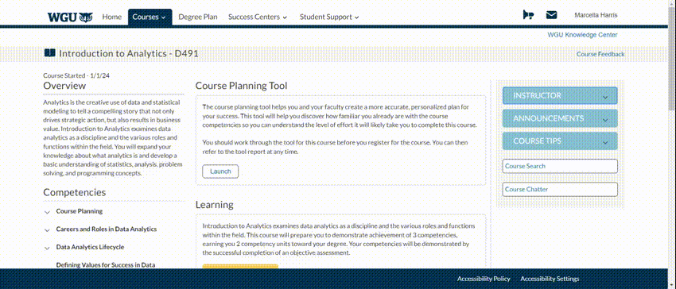

### D491 Introduction to Analytics - 2 Credits

This course doesn't have much to elaborate on. Once you're enrolled, visit the course page. On the right side, below your course instructor's profile, you'll find a tab labeled 'Course Tips' with a link to the resources directory, highlighted in blue. Just click on it.

 

Once you're there, feel free to review and download any files you find useful. Personally, I downloaded two files: the course guide and the study guide. I focused primarily on the study guide. I utilized all external course materials and videos, thoroughly read each section from start to finish, and answered all study guide topics. I then organized my notes using the Cornell Notetaking method.

For all pre-assessment (PrA) questions, vocabulary, and terms, I created Anki cards. Additionally, I discovered a valuable Quizlet deck which I also created a deck for. Here's the link: [Quizlet Flashcards](https://quizlet.com/868238957/introduction-to-analytics-d491-flash-cards/).

#### Resources
Feel free to utilize or modify any of the resources I have created. Apologies in advance for any typos that may be present, particularly within the Anki cards.
