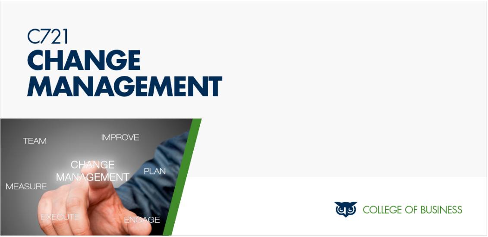

# Change Management

> *Change Management provides an understanding of change and an overview of successfully managing change using various methods and tools. Emphasizing change theories and various best practices, this course covers how to recognize and implement change using an array of other effective strategies, including those related to innovation and leadership. Other topics include approaches to change, diagnosing and planning for change, implementing change, and sustaining change.*
> __-WGU__
 

 
$${\color{lightgreen}Yay, \space I \space passed!}$$ on March 15th, 2024.
 
 

In this course, I had to demonstrate my understanding of the course material by acting as a change management consultant for a hypothetical manufacturing company. What caught my attention was how the instructions for the course pushed me to write more creatively, breaking away from the usual essay format and making the content more interesting.

I approached the tasks as if I were a real consultant, tackling each of the eight tasks (A-G) one by one. The final task served as a comprehensive check of my work. I ensured not to proceed to the next task until I had completed the current one. Task A proved to be the most challenging for me, as starting a written project often poses difficulties.

My strategy was to select a model that would allow me to explain and demonstrate my understanding most effectively. I opted for the Systems Contingency model. I promise you that as you progress through the other tasks, they will become easier to respond to and complete.

An added benefit of this course is that upon passing, you'll receive a voucher for MSI's Change Management Certification.