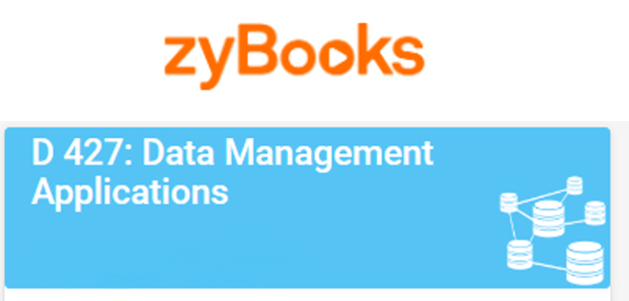

# Data Management Applications

> *Data Management - Applications covers conceptual data modeling and introduces MySQL. Students will learn how to create simple to complex SELECT queries, including subqueries and joins, and how to use SQL to update and delete data. Topics covered in this course include exposure to MySQL; creating and modifying databases, tables, views, foreign keys and primary keys (FKs and PKs), and indexes; populating tables; and developing simple Select-From-Where (SFW) queries to complex 3+ table join queries. The following course is a prerequisite: Data Management - Foundations.*
> __-WGU__
 

 

 
 

Data Management Applications was taught in a way that, given the choice, I would change. Students were required to use a service called zyBooks. Initially, I thought I would enjoy it because of its interactivity. However, the lack of videos made the overall experience quite boring. Although the quick tasks, quizzes, and tests included GIF-like clips, they didn't significantly enhance the learning process.

Nevertheless, I found great benefit in utilizing YouTube and W3Schools. Despite having prior SQL experience with MySQL and SQLite, there were moments when I struggled, even with basic SELECT statements because the course material often seemed to overexplain simple concepts.

Attending every available cohort session proved valuable as well. Randomly discussed nuggets of information provided insights I hadn't encountered before. Just a quick note, don't underestimate the material covered during these sessions because more than likely some versions will be on the objective assessment (OA).

Inside zyBooks, there are eight chapters, each containing multiple sub-chapters, ranging from 6 to 14 sections. To facilitate learning, I downloaded all the chapters into multiple PDF files and exported them to my reMarkable E Ink writing tablet. I would then write out the code or mark my answers where necessary. Afterwards, I would input these answers into zyBooks to ensure they were recorded accurately. This approach allowed me to review my mistakes later on and receive feedback to correct answers.

This course is intensive, so allocating time to read the zyBook chapters and practice SQL code from external sources is crucial, especially for newcomers to the language.
 

 

 on April 3rd, 2024
